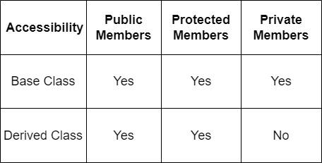

# Inheritance

## Contents
* [1. Introduction about inheritance](#1-introduction-about-inheritance)
    * [1.1. Example](#11-example)
        * [1.1.1. Explanation of the code](#111-explanation-of-the-code)
* [2. Types of Inheritance in C++](#2-types-of-inheritance-in-c)
    * [2.1. Single Inheritance](#21-single-inheritance)
        * [2.1.2. Example](#212-example)
    * [2.2. Multiple Inheritance](#22-multiple-inheritance)
        * [2.2.1. Example](#221-example)
    * [2.3. Multilevel Inheritance](#23-multilevel-inheritance)
        * [2.3.1. Example](#231-example)
    * [2.4. Hierarchical Inheritance](#24-hierarchical-inheritance)
        * [2.4.1. Example](#241-example)
    * [2.5. Hybrid Inheritance](#25-hybrid-inheritance)
        * [2.5.1. Example](#251-example)
    * [2.6. Ambiguity in Hybrid Inheritance](#26-ambiguity-in-hybrid-inheritance)
    * [2.7. Benefits of Inheritance](#27-benefits-of-inheritance)
* [3. Access Modifiers with Inheritance](#3-access-modifiers-with-inheritence)
    * [3.1. Examples](#31-examples)

## 1. Introduction about inheritance
Inheritance is a fundamental concept in object-oriented programming (OOP) that allows a new class (derived class) to inherit properties and behaviors (data members and methods) from an existing class (base class). This promotes code reusability and establishes a natural hierarchy between classes.

In simple terms, inheritance allows you to create a new class that is a modified version of an existing class. The new class can add its own features and modify the behavior of the inherited methods.

### 1.1. Example
Consider we have a base class `Animal` and a derived class `Dog` that inherits from `Animal`.

```c++
#include <iostream>
#include <string>

// Base class
class Animal {
protected:
    std::string name;

public:
    Animal(std::string n) : name(n) {}

    // Base class method
    void eat() {
        std::cout << name << " is eating." << std::endl;
    }

    void sleep() {
        std::cout << name << " is sleeping." << std::endl;
    }
};

// Derived class
class Dog : public Animal {
public:
    Dog(std::string n) : Animal(n) {}

    // Derived class method
    void bark() {
        std::cout << name << " is barking." << std::endl;
    }
};

int main() {
    // Create a Dog object
    Dog myDog("Buddy");

    // Calling base class methods
    myDog.eat();
    myDog.sleep();

    // Calling derived class method
    myDog.bark();

    return 0;
}
```

#### 1.1.1. Explanation of the code:
1. **Base Class (`Animal`)**: The `Animal` class defines common attributes and behaviors for all animals, such as `name`, `eat()`, and `sleep()`.
2. **Derived Class (`Dog`)**: The `Dog` class inherits from `Animal`, meaning it automatically has all the properties and methods of `Animal`. It also defines an additional method, `bark()`, which is specific to dogs.
3. **Inheritance in Action**: When the `Dog` object `myDog` is created, it can use both the methods inherited from `Animal` (`eat()` and `sleep()`) and its own method (`bark()`).

## 2. Types of Inheritance in C++
### 2.1. Single Inheritance
In single inheritance, a derived class inherits from only one base class.

#### 2.1.2. Example:
```cpp
#include <iostream>

// Base class
class Animal {
public:
    void eat() {
        std::cout << "Eating..." << std::endl;
    }
};

// Derived class
class Dog : public Animal {
public:
    void bark() {
        std::cout << "Barking..." << std::endl;
    }
};

int main() {
    Dog myDog;
    myDog.eat();   // Inherited from Animal
    myDog.bark();  // Defined in Dog
    return 0;
}
```

### 2.2. Multiple Inheritance
In multiple inheritance, a derived class inherits from more than one base class. This allows the derived class to inherit features from all its base classes.

#### 2.2.1. Example:
```cpp
#include <iostream>

// Base class 1
class Engine {
public:
    void start() {
        std::cout << "Engine started." << std::endl;
    }
};

// Base class 2
class Radio {
public:
    void playMusic() {
        std::cout << "Playing music..." << std::endl;
    }
};

// Derived class
class Car : public Engine, public Radio {
public:
    void drive() {
        std::cout << "Driving..." << std::endl;
    }
};

int main() {
    Car myCar;
    myCar.start();      // Inherited from Engine
    myCar.playMusic();  // Inherited from Radio
    myCar.drive();      // Defined in Car
    return 0;
}
```

### 2.3. Multilevel Inheritance
In multilevel inheritance, a derived class is derived from another derived class. This creates a multi-layered inheritance hierarchy.

#### 2.3.1. Example:
```cpp
#include <iostream>

// Base class
class Animal {
public:
    void eat() {
        std::cout << "Eating..." << std::endl;
    }
};

// Derived class
class Mammal : public Animal {
public:
    void breathe() {
        std::cout << "Breathing..." << std::endl;
    }
};

// Further derived class
class Dog : public Mammal {
public:
    void bark() {
        std::cout << "Barking..." << std::endl;
    }
};

int main() {
    Dog myDog;
    myDog.eat();      // Inherited from Animal
    myDog.breathe();  // Inherited from Mammal
    myDog.bark();     // Defined in Dog
    return 0;
}
```

### 2.4. Hierarchical Inheritance
In hierarchical inheritance, multiple derived classes inherit from a single base class. This allows different derived classes to inherit common functionality from the base class.

#### 2.4.1. Example:
```cpp
#include <iostream>

// Base class
class Animal {
public:
    void eat() {
        std::cout << "Eating..." << std::endl;
    }
};

// Derived class 1
class Dog : public Animal {
public:
    void bark() {
        std::cout << "Barking..." << std::endl;
    }
};

// Derived class 2
class Cat : public Animal {
public:
    void meow() {
        std::cout << "Meowing..." << std::endl;
    }
};

int main() {
    Dog myDog;
    Cat myCat;

    myDog.eat();   // Inherited from Animal
    myDog.bark();  // Defined in Dog

    myCat.eat();   // Inherited from Animal
    myCat.meow();  // Defined in Cat

    return 0;
}
```

### 2.5. Hybrid Inheritance
Hybrid inheritance is a combination of two or more types of inheritance. It can involve multiple inheritance, hierarchical inheritance, or multilevel inheritance. Hybrid inheritance can sometimes lead to ambiguity, especially in cases where multiple base classes have methods with the same name.

#### 2.5.1. Example:
```cpp
#include <iostream>

// Base class 1
class Engine {
public:
    void start() {
        std::cout << "Engine started." << std::endl;
    }
};

// Base class 2
class Vehicle {
public:
    void drive() {
        std::cout << "Vehicle is driving." << std::endl;
    }
};

// Derived class from Engine and Vehicle
class Car : public Engine, public Vehicle {
public:
    void honk() {
        std::cout << "Honking..." << std::endl;
    }
};

// Another derived class
class ElectricCar : public Car {
public:
    void chargeBattery() {
        std::cout << "Charging battery..." << std::endl;
    }
};

int main() {
    ElectricCar myElectricCar;
    myElectricCar.start();          // Inherited from Engine
    myElectricCar.drive();          // Inherited from Vehicle
    myElectricCar.honk();           // Inherited from Car
    myElectricCar.chargeBattery();  // Defined in ElectricCar
    return 0;
}
```

### 2.6. Ambiguity in Hybrid Inheritance
When multiple base classes contain methods with the same name, it can create ambiguity. This can be resolved using virtual inheritance, which ensures that only one instance of the base class is created, even if it is inherited by multiple derived classes.

```cpp
#include <iostream>

// Base class
class Person {
public:
    void display() {
        std::cout << "Person display" << std::endl;
    }
};

// Derived class 1
class Faculty : public virtual Person {};

// Derived class 2
class Student : public virtual Person {};

// Derived class from Faculty and Student
class TA : public Faculty, public Student {};

int main() {
    TA myTA;
    myTA.display();  // No ambiguity due to virtual inheritance
    return 0;
}
```

### 2.7. Benefits of Inheritance
1. **Code Reusability**: Inheritance allows for the reuse of code from the base class in the derived classes, reducing redundancy and improving maintainability.
2. **Extensibility**: New features can be added to an existing class hierarchy by introducing new derived classes without altering the existing code.
3. **Hierarchy Representation**: Inheritance helps in representing real-world relationships and hierarchies, making the design more intuitive and structured.
4. **Polymorphism**: Inheritance is closely related to polymorphism. It allows objects of derived classes to be treated as objects of the base class, enabling dynamic method binding.


## 3. Access modifiers with Inheritence
**public inheritance** makes public members of the base class public in the derived class, and the protected members of the base class remain protected in the derived class.

**protected inheritance** makes the public and protected members of the base class protected in the derived class.

**private inheritance** makes the public and protected members of the base class private in the derived class.

Accessibility Of Inheritance Access:

<p align="center">
  
</p>

It is good to visit this site: [C++ Public, Protected, and Private Inheritance](https://takeuforward.org/c/c-public-protected-and-private-inheritance/)

### 3.1. Examples:
see the following examples:
* [0x07-public_inheritance.cpp](./0x07-public_inheritance.cpp)
* [0x07-private_inheritance.cpp](./0x07-private_inheritance.cpp)
* [0x07-protected_inheritance.cpp](./0x07-protected_inheritance.cpp)
