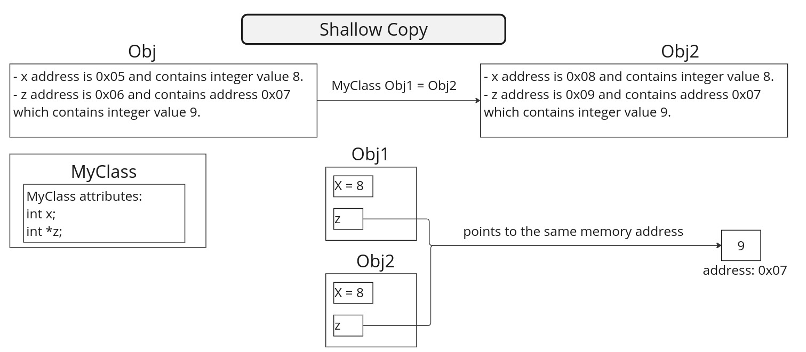
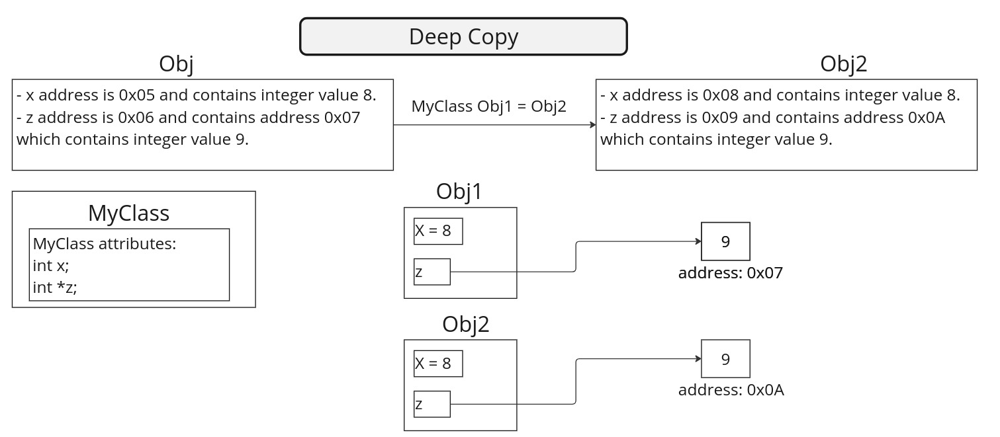

# Shallow Copy and Deep Copy in C++
In C++, **shallow copy** and **deep copy** are concepts that relate to how data is copied from one object to another.

The key difference between the two lies in how they handle pointers and dynamic memory.

In general, creating a copy of an object means to create an exact replica of the object having the same literal value, data type, and resources. There are two ways that are used by C++ compiler to create a copy of objects. The two ways are:
* Copy Constructor
* Assignment Operator

```c++
// Copy Constructor
ClassT Obj1(Obj);
// or
// ClassT Obj = Obj;

// Default assignment operator
ClassT Obj2;
Obj2 = Obj1;
```

**Depending** upon the resources like **dynamic memory** held by the object, either we need to perform **Shallow Copy** or **Deep Copy** in order to create a replica of the object. In general, **if the variables of an object have been dynamically allocated**, then it is required to do a **Deep Copy** in order to create a copy of the object.

## Shallow Copy
A shallow copy of an object copies all of the object's member variables to another object bit by bit. If the object contains pointers, only the pointers are copied, not the data they point to. This means that both the original and the copied objects will share the same memory location for any dynamically allocated memory.



## Deep Copy
A deep copy of an object copies all of the object's member variables and allocates separate memory for dynamically allocated memory (e.g., pointers). This means that the original and copied objects are completely independent, and changes made to one do not affect the other.



## Examples:
* [0x04-shallow_copy.cpp](./0x04-shallow_copy.cpp)
* [0x05-shallow_copy.cpp](./0x05-shallow_copy.cpp)
* [0x06-deep_copy.cpp](./0x06-deep_copy.cpp)

