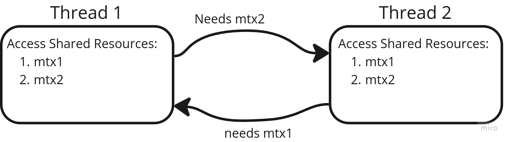

# Deadlock
Deadlock is a problem which occures due to bad design of a system. Deadlock occurs when two or more processes are unable to proceed because each one is waiting for the other to release resources that they need.

When deadlock occurs, all processes are stuck and unable to make progress. This can lead to a system that is not functional and can cause data corruption.

To solve deadlock problem, we need to restructure our system design.

## What is Deadlock?
Deadlock is a situation in computer science, particularly in operating systems and databases, where two or more processes are unable to proceed because each is waiting for resources held by the other. Let’s break down the concept of deadlock, how it happens, and its components in a step-by-step manner.

### 1. **Basic Definition and Example of Deadlock**

   Deadlock occurs when:
   - Two or more processes (or threads) need resources to proceed.
   - Each process has a resource, but it’s waiting for a resource that’s held by another process.
   - No process can proceed because they’re all waiting indefinitely.

   **Example:** Suppose we have two processes, A and B, and two resources, X and Y:
   - Process A holds resource X and needs resource Y to complete.
   - Process B holds resource Y and needs resource X to complete.
   - Since each process is waiting for the other to release its resource, both remain indefinitely stuck, resulting in a deadlock.

### 2. **Key Conditions for Deadlock (Coffman Conditions)**

   For a deadlock to occur, four specific conditions must be met simultaneously:

   - **Mutual Exclusion**: At least one resource must be non-shareable. In other words, only one process can use a resource at any given time. 
   - **Hold and Wait**: A process holding at least one resource is waiting to acquire additional resources held by other processes.
   - **No Preemption**: A resource can’t be forcibly taken away from a process holding it; it must be released voluntarily by the process.
   - **Circular Wait**: A set of processes is waiting in a circular chain, where each process holds a resource the next process needs.

   When all these conditions are present, a deadlock is possible.

### 3. **Example Illustrating Deadlock Conditions**

   Let's look at a detailed example with these four conditions:
   
   - **Step 1**: Process A starts executing and locks Resource X.
   - **Step 2**: Process B starts executing and locks Resource Y.
   - **Step 3**: Process A tries to lock Resource Y (currently held by Process B), so it goes into a waiting state.
   - **Step 4**: Process B tries to lock Resource X (currently held by Process A), so it also goes into a waiting state.
   
   Now, Process A is waiting for Process B to release Resource Y, and Process B is waiting for Process A to release Resource X. This circular waiting creates a deadlock.

### 4. **Types of Deadlock**

   There are mainly two types of deadlocks:
   
   - **Resource Deadlock**: This is the classic form of deadlock, as seen in the example above, where processes are waiting for resources held by each other.
   - **Communication Deadlock**: In systems where processes communicate by sending and receiving messages, a deadlock can occur if each process waits indefinitely for a message from the other process.

### 5. **Methods to Handle Deadlock**

   Deadlocks can be handled in several ways:

   - **Prevention**: Modify the system design to break one of the four Coffman conditions. For example:
     - Use resource hierarchy ordering to prevent circular wait.
     - Avoid hold and wait by making processes request all resources at once.
   - **Avoidance**: Use an algorithm (like the Banker's Algorithm) to analyze resource allocation and ensure that the system avoids unsafe states that could lead to deadlock.
   - **Detection and Recovery**: Allow deadlocks to occur but have a system that detects them and takes action to recover, such as terminating or restarting processes or forcibly reclaiming resources.
   - **Ignore the Problem**: In some systems, deadlock is rare, so it's ignored entirely (often called the Ostrich Algorithm).

### 6. **Deadlock in Databases**

   In databases, deadlock often occurs during transactions where two transactions wait for resources locked by each other. Database management systems (DBMS) detect deadlocks using wait-for graphs and resolve them by terminating one of the transactions involved.

### 7. **Detecting Deadlocks**

   - **Wait-for Graph**: In this approach, a directed graph is created where nodes represent processes and edges represent resources. If there’s a cycle in the graph, a deadlock exists.
   - **Timeout Mechanisms**: Some systems use a timeout to detect if a process is waiting too long for a resource. If it exceeds the timeout, the system assumes a deadlock and takes corrective action.

## Deadlock example with C++
In C++, a *deadlock* is a situation where two or more threads are unable to proceed because each one is waiting for the other to release resources that they need. Deadlocks can be tricky to debug because they don't always manifest immediately and can vary depending on the system state and thread timing.

Let's go through deadlocks from scratch, step by step:

### 1. **Understanding the Basics of Multithreading and Mutexes**

   In a multithreaded program, *mutexes* are used to prevent multiple threads from accessing shared resources at the same time. When a thread acquires a mutex, other threads trying to acquire it are blocked until the mutex is released.

   ```cpp
   #include <iostream>
   #include <thread>
   #include <mutex>

   std::mutex mtx;  // This is a simple mutex

   void criticalSection() {
       mtx.lock();  // Lock the mutex
       // Critical section (only one thread can access this at a time)
       std::cout << "Thread " << std::this_thread::get_id() << " in critical section\n";
       mtx.unlock();  // Unlock the mutex
   }
   ```

### 2. **Defining Deadlock in a Real-World Context**

   Imagine two friends, Alice and Bob, are eating. Each one has a spoon and a fork. But they need both utensils to eat their food. Here’s a possible deadlock scenario:
   - Alice picks up her spoon and waits for the fork (which Bob has).
   - Bob picks up his fork and waits for the spoon (which Alice has).

   Since neither can proceed without the other releasing their utensil, both are stuck—this is a deadlock.

### 3. **Reproducing Deadlock in C++ Code**

   Now, let’s model this in C++ using two mutexes to represent resources, and two threads to represent tasks trying to acquire both resources. Each thread locks one mutex and tries to lock the other, leading to a deadlock.

   ```cpp
   #include <iostream>
   #include <thread>
   #include <mutex>

   std::mutex mtx1;
   std::mutex mtx2;

   void taskA() {
       std::lock_guard<std::mutex> lock1(mtx1);  // Lock mtx1
       std::cout << "Task A has locked mtx1 and is trying to lock mtx2\n";
       std::this_thread::sleep_for(std::chrono::milliseconds(100));  // Small delay
       
       std::lock_guard<std::mutex> lock2(mtx2);  // Try to lock mtx2
       std::cout << "Task A has locked both mtx1 and mtx2\n";
   }

   void taskB() {
       std::lock_guard<std::mutex> lock2(mtx2);  // Lock mtx2
       std::cout << "Task B has locked mtx2 and is trying to lock mtx1\n";
       std::this_thread::sleep_for(std::chrono::milliseconds(100));  // Small delay
       
       std::lock_guard<std::mutex> lock1(mtx1);  // Try to lock mtx1
       std::cout << "Task B has locked both mtx1 and mtx1\n";
   }

   int main() {
       std::thread t1(taskA);
       std::thread t2(taskB);

       t1.join();
       t2.join();

       return 0;
   }
   ```

### 4. **Understanding Why This Code Causes Deadlock**

   - `taskA` locks `mtx1` first and then attempts to lock `mtx2`.
   - `taskB` locks `mtx2` first and then attempts to lock `mtx1`.
   - If `taskA` holds `mtx1` and `taskB` holds `mtx2`, neither task can proceed, as each is waiting on a lock held by the other.

### 5. **Conditions Leading to Deadlock**

   Deadlock occurs if all of the following four conditions are met (known as the Coffman conditions):
   - **Mutual Exclusion**: Only one thread can hold a resource at a time.
   - **Hold and Wait**: A thread holding at least one resource is waiting to acquire additional resources held by other threads.
   - **No Preemption**: Resources cannot be forcibly taken from threads holding them.
   - **Circular Wait**: A closed chain of threads exists, where each thread holds a resource that the next thread in the chain requires.

### 6. **Avoiding Deadlocks**

   Here are some common strategies to avoid deadlocks:

   - **Lock Ordering**: If every thread always locks mutexes in the same order, you can prevent deadlocks. For example, if both `taskA` and `taskB` always lock `mtx1` before `mtx2`, they won’t end up in a deadlock.
   
   - **Try-Lock Mechanism**: Using `try_lock`, a thread can attempt to acquire a lock without blocking. If the lock is already taken, the thread can release any other resources and try again later.

     ```cpp
     void taskA() {
         while (true) {
             if (mtx1.try_lock()) {
                 if (mtx2.try_lock()) {
                     std::cout << "Task A acquired both mtx1 and mtx2\n";
                     mtx2.unlock();
                     mtx1.unlock();
                     break;
                 }
                 mtx1.unlock();
             }
             std::this_thread::sleep_for(std::chrono::milliseconds(10));
         }
     }
     ```

   - **Use std::lock**: In C++, the `std::lock` function can atomically lock multiple mutexes without risking deadlock.

     ```cpp
     void taskA() {
         std::lock(mtx1, mtx2);  // Locks mtx1 and mtx2 atomically
         std::cout << "Task A has locked both mtx1 and mtx2\n";
         mtx1.unlock();
         mtx2.unlock();
     }
     ```

### 7. **Testing and Debugging Deadlocks**

   Detecting deadlocks can be challenging. Here are some tips:
   - **Use Debugging Tools**: Tools like Valgrind (Linux) and Visual Studio Debugger (Windows) can detect deadlocks.
   - **Timeouts**: Adding timeouts for lock acquisition can help detect deadlocks and recover gracefully.

## See the Deadlock Example 0x0C-deadlock.cpp
the following happened in the example code:

<p align="center">
  
</p>

run the code and see the output:
```bash
g++ -std=c++17 0x0C-deadlock.cpp -o 0x0C-deadlock && ./0x0C-deadlock
```
