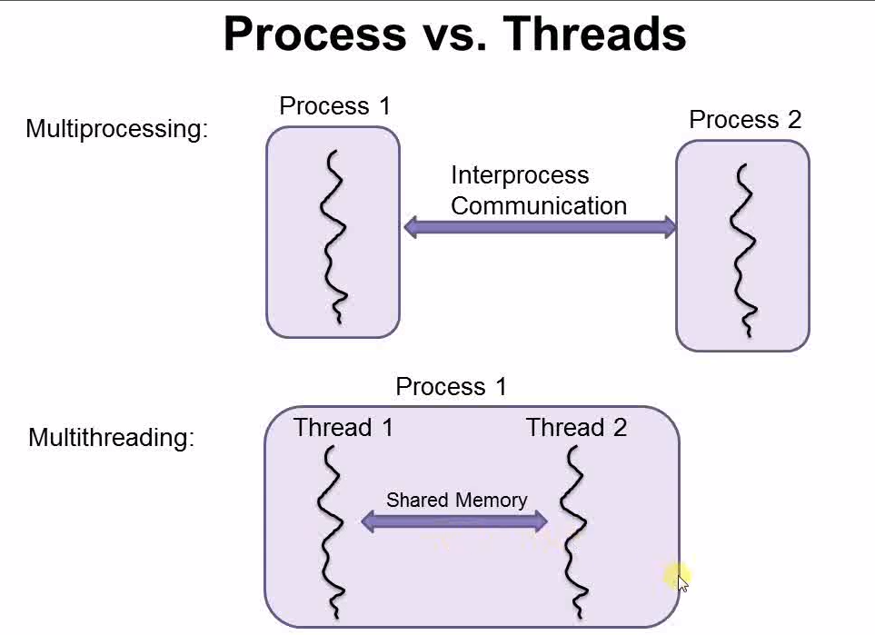

# Concurrency
Concurrency in C++ is a powerful feature that enables developers to create applications capable of performing multiple tasks simultaneously.

Concurrency refers to the ability to process multiple tasks or threads at the same time. It is used to improve the program’s performance and response time. In this article, we will discuss how concurrency is achieved in C++ and what are its benefits.

Genrally there are two kinds of concurrent programming models:
* Multiprocessing: each process has only one thread running, and all the processes communicate with each other through the regular **interprocess communication** channels (such as files, pipes, message queues, and etc).
* Multithreading: One process contains two or more threads and all the threads communicate with each other through **shared memory**.
    * **Pros:**
        * **Fast to start** (it is usually slow and complicated to start a process because the operating system needs to devote a bunch of internal resources to manage the process). **A thread is considered as a light-weight process**.
        * **Low overhead** (thread takes lower overhead in running). A process has more overhead (**example:** the OS needs to provide a lot of protection for the process, so that one process will not accedently step onto another process). **Communicating through shared memory is a lot faster** than communicating through interprocess communication channels.
    * **Cons:**
        * **Difficult to implement**: there are bunch of threading specific issues that needs to be carefully handled.
        * **Cannot run on distributed systems** (A multiprocessing program can be easily distributed to multiple computers and long concurrently)

**Note:** Multithreading provides better performance than multiprocessing.

<dev align="center">
  

  
 Process vs. Thread 

</dev>

## Resources:
- [Concurrency in C++ : Multithreading and Concurrent Programming](https://medium.com/@lfoster49203/concurrency-in-c-multithreading-and-concurrent-programming-ccf81110c284)
- [Concurrency in C++ - GeeksforGeeks](https://www.geeksforgeeks.org/cpp-concurrency/)
